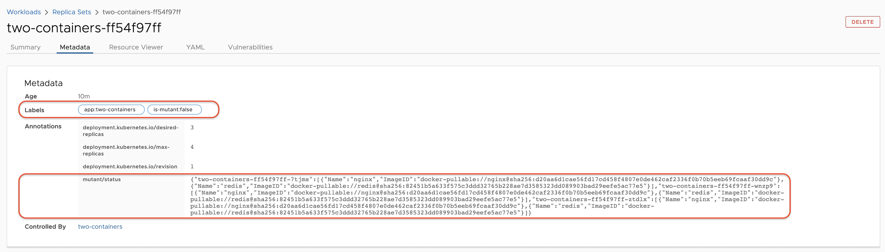

# k8s-mutant-detector

## TL;DR;

This is a simple Kubernetes ReplicaSet controller that detects mutant ReplicaSets. We define mutant ReplicaSet
as one referring to mutant container image.

Let's consider the following descriptor of a sample Deployment. It has two containers referring to `nginx:1.16`
and `redis:5` images. If any of those images is mutant you may end up with pods running in your cluster in different
versions.

```
apiVersion: apps/v1
kind: Deployment
metadata:
  labels:
    app: two-containers
  name: two-containers
  namespace: default
spec:
  replicas: 3
  selector:
    matchLabels:
      app: two-containers
  template:
    metadata:
      labels:
        app: two-containers
    spec:
      containers:
      - image: nginx:1.16
        name: nginx
      - image: redis:5
        name: redis
```

To detect mutant ReplicaSet, k8s-mutant-detector is labeling and annotating ReplicaSets as depicted in the following
screenshot. The value of the `mutant/status` annotation aggregates image digests used by pods managed by a particular
ReplicaSet. Then the value of the `is-mutant` label is the boolean output of anaylzing the mutant state.



## Examples

### Mutant status of a workload with three replicas and a single container

```json
{
  "wordpress-6ff85b49b8-brw6p": [
    {
      "Name": "wordpress",
      "ImageID": "docker-pullable://wordpress@sha256:7e476394586459bb622d3f37448cd07e703ec6906257d232542f2f51ff073da7"
    }
  ],
  "wordpress-6ff85b49b8-gk5bj": [
    {
      "Name": "wordpress",
      "ImageID": "docker-pullable://wordpress@sha256:7e476394586459bb622d3f37448cd07e703ec6906257d232542f2f51ff073da7"
    }
  ],
  "wordpress-6ff85b49b8-st65n": [
    {
      "Name": "wordpress",
      "ImageID": "docker-pullable://wordpress@sha256:7e476394586459bb622d3f37448cd07e703ec6906257d232542f2f51ff073da7"
    }
  ]
}
```

### Mutant status of a workload with three replicas and two containers

```json
{
  "two-containers-ff54f97ff-7tjms": [
    {
      "Name": "nginx",
      "ImageID": "docker-pullable://nginx@sha256:d20aa6d1cae56fd17cd458f4807e0de462caf2336f0b70b5eeb69fcaaf30dd9c"
    },
    {
      "Name": "redis",
      "ImageID": "docker-pullable://redis@sha256:82451b5a633f575c3ddd32765b228ae7d3585323dd089903bad29eefe5ac77e5"
    }
  ],
  "two-containers-ff54f97ff-wnzp9": [
    {
      "Name": "nginx",
      "ImageID": "docker-pullable://nginx@sha256:d20aa6d1cae56fd17cd458f4807e0de462caf2336f0b70b5eeb69fcaaf30dd9c"
    },
    {
      "Name": "redis",
      "ImageID": "docker-pullable://redis@sha256:82451b5a633f575c3ddd32765b228ae7d3585323dd089903bad29eefe5ac77e5"
    }
  ],
  "two-containers-ff54f97ff-ztdlx": [
    {
      "Name": "nginx",
      "ImageID": "docker-pullable://nginx@sha256:d20aa6d1cae56fd17cd458f4807e0de462caf2336f0b70b5eeb69fcaaf30dd9c"
    },
    {
      "Name": "redis",
      "ImageID": "docker-pullable://redis@sha256:82451b5a633f575c3ddd32765b228ae7d3585323dd089903bad29eefe5ac77e5"
    }
  ]
}
```

https://kubernetes.io/docs/concepts/containers/images/
