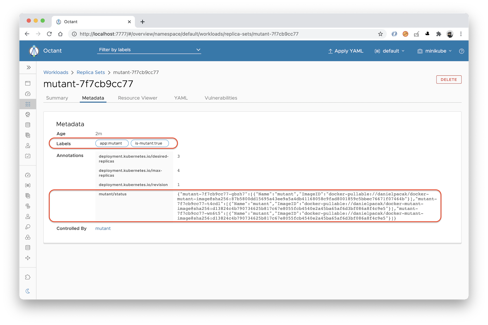
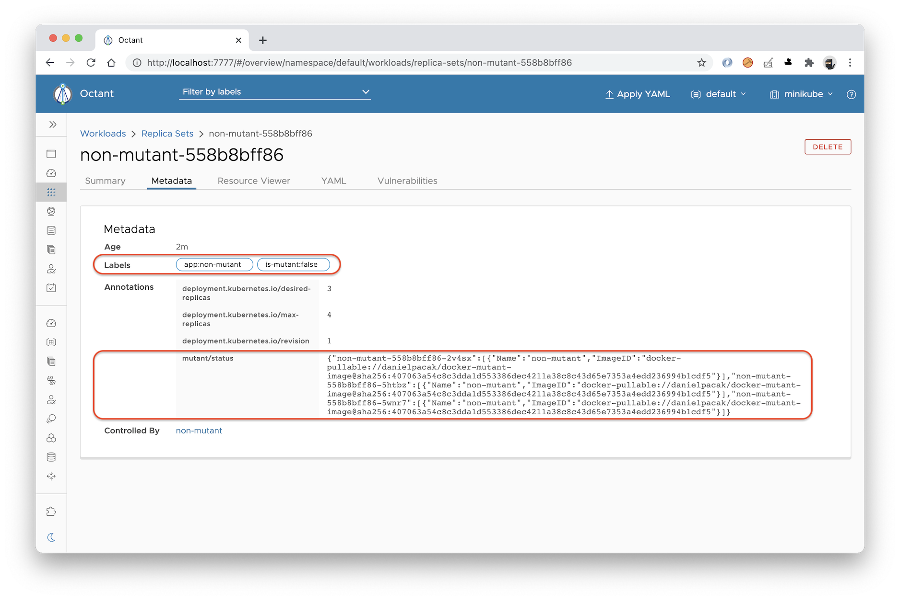

# k8s-mutant-detector

> Detects mutant workloads in your Kubernetes cluster.

## TOC

- [Introduction](#introduction)
- [Why don't you use static analysis?](#why-dont-you-use-static-analysis)
- [How can we find mutant workloads?](#how-can-we-find-mutant-workloads)
- [What is the structure of the mutant status](#what-is-the-structure-of-the-mutant-status)
- [References](#references)

## Introduction

This is a simple Kubernetes ReplicaSet controller that detects mutant ReplicaSets. We define a mutant ReplicaSet
as one referring to at least one mutant container image. A mutant container image is when its tags can change over
time. In other words, it does not implement the immutable tags principle. For example, when you pull the same image
twice, and you end up with different image digests, that's a mutant image.

1. Pull `danielpacak/docker-mutant-image:1.0` at T<sub>1</sub>
   ```
   $ docker pull danielpacak/docker-mutant-image:1.0
   1.0: Pulling from danielpacak/docker-mutant-image
   54fec2fa59d0: Already exists
   5546cfc92772: Already exists
   50f62e3cdaf7: Already exists
   Digest: sha256:814e9648be575931b64b555ddc1a8939e37d0550f0d651fbf591a4a8822d4f62
   Status: Downloaded newer image for danielpacak/docker-mutant-image:1.0
   docker.io/danielpacak/docker-mutant-image:1.0
   ```
2. Modify `danielpacak/docker-mutant-image:1.0` at T<sub>2</sub>
3. Pull `danielpacak/docker-mutant-image:1.0` at T<sub>3</sub>
   ```
   $ docker pull danielpacak/docker-mutant-image:1.0
   1.0: Pulling from danielpacak/docker-mutant-image
   54fec2fa59d0: Already exists
   5546cfc92772: Already exists
   50f62e3cdaf7: Already exists
   Digest: sha256:407063a54c8c3dda1d553386dec4211a38c8c43d65e7353a4edd236994b1cdf5
   Status: Downloaded newer image for danielpacak/docker-mutant-image:1.0
   docker.io/danielpacak/docker-mutant-image:1.0
   ```

Let's consider the following descriptor of the `mutant` Deployment. It has the single `mutant` container referring to
the [`danielpacak/docker-mutant-image:1.0`](https://github.com/danielpacak/docker-mutant-image) image by tag. It does
not pin the image digest which would be a common solution to mitigate the risk of ending up with mutant workloads
running in your cluster.

```yaml
apiVersion: apps/v1
kind: Deployment
metadata:
  labels:
    app: mutant
  name: mutant
spec:
  replicas: 1
  selector:
    matchLabels:
      app: mutant
  template:
    metadata:
      labels:
        app: mutant
    spec:
      containers:
        - image: danielpacak/docker-mutant-image:1.10
          name: mutant

```

The following screenshot of ReplicaSet metadata shows the `is-mutant=true` label and the `mutant/status` annotation
added by k8s-mutant-detector to indicate that it is a mutant workload.



If you look closely at the value of the `mutant/status` annotation you'll see that the `mutant-7f7cb9cc77-gbzh7` pod
runs different container image than `mutant-7f7cb9cc77-t4cdl` and `mutant-7f7cb9cc77-wn6t5` pods.

| Pod Name | Image Digest |
|----------|--------------|
| mutant-7f7cb9cc77-gbzh7 | **danielpacak/docker-mutant-image@sha256:87b5800dd15695a43ee9a5a4db41168058c9fad8001859c5bbec76671f07464b** |
| mutant-7f7cb9cc77-t4cdl | danielpacak/docker-mutant-image@sha256:d13824c4b790734625b817c67e8055fcb4540e2a45ba65af6d3bf086a8f4c9e5 |
| mutant-7f7cb9cc77-wn6t5 | danielpacak/docker-mutant-image@sha256:d13824c4b790734625b817c67e8055fcb4540e2a45ba65af6d3bf086a8f4c9e5 |

Let's consider another descriptor of the `non-mutant` Deployment. It has the single `non-mutant` container referring to
the `danielpacak/docker-mutant-image:1.0@sha256:407063a54c8c3dda1d553386dec4211a38c8c43d65e7353a4edd236994b1cdf5` image
by tag and digest. This is the most predictable way of specify image reference, but not always possible or convenient.

```yaml
apiVersion: apps/v1
kind: Deployment
metadata:
  labels:
    app: non-mutant
  name: non-mutant
spec:
  replicas: 1
  selector:
    matchLabels:
      app: non-mutant
  template:
    metadata:
      labels:
        app: non-mutant
    spec:
      containers:
        - name: non-mutant
          image: danielpacak/docker-mutant-image:1.0@sha256:407063a54c8c3dda1d553386dec4211a38c8c43d65e7353a4edd236994b1cdf5
          imagePullPolicy: Always

```

This time you can see that it is marked as non mutant by k8s-mutant-detector even though I modified
the `danielpacak/docker-mutant-image:1.0` tag before scaling the `non-mutant` Deployment from two to three replicas.



Finally, if you look at the mutant status closely, all the pods are running container images with the same digest.

| Pod Name | Image Digest |
|----------|--------------|
| non-mutant-558b8bff86-2v4sx | danielpacak/docker-mutant-image@sha256:407063a54c8c3dda1d553386dec4211a38c8c43d65e7353a4edd236994b1cdf5 |
| non-mutant-558b8bff86-5htbz | danielpacak/docker-mutant-image@sha256:407063a54c8c3dda1d553386dec4211a38c8c43d65e7353a4edd236994b1cdf5 |
| non-mutant-558b8bff86-5wnr7 | danielpacak/docker-mutant-image@sha256:407063a54c8c3dda1d553386dec4211a38c8c43d65e7353a4edd236994b1cdf5 |

## Why don't you use static analysis?

You cannot reliably detect mutant workloads with static analysis tools that lint or check your YAML
descriptors or Helm chart templates. Even if someone is using image references that may look like immutable and
semantically version, in reality they may have good reasons to override existing tags from time to time.

The only way is to look into `containerStatuses` of a running pod.

```yaml
apiVersion: v1
kind: Pod
status:
  containerStatuses:
  - containerID: docker://8e485bc2321faea9a391ccdc150bb9b539d6fea27b89e0f935cf4234ed95cc98
    image: danielpacak/docker-mutant-image:1.0
    imageID: docker-pullable://danielpacak/docker-mutant-image@sha256:87b5800dd15695a43ee9a5a4db41168058c9fad8001859c5bbec76671f07464b
    lastState: {}
    name: mutant
    ready: true
    restartCount: 0
    started: true
    state:
      running:
        startedAt: "2020-11-25T15:11:49Z"
```

## How can we find mutant workloads?

You can list mutant workloads across the cluster with a very simple label selector `is-mutant=true`.

```
$ kubectl get rs -l is-mutant=true -A
NAMESPACE   NAME                DESIRED   CURRENT   READY   AGE
default     mutant-7f7cb9cc77   3         3         3       79m
```

## What is the structure of the mutant status?

In general, the structure of the mutant status, which is then encoded as the value of the `mutant/status` annotation,
looks as follows:

```json
{
  "pod-1": [
    {
      "Name": "container-1",
      "ImageID": "pod-1-container-1-digest"
    },
    {
      "Name":  "container-2",
      "ImageID":  "pod-1-container-2-digest"
    },
    {
      "Name":  "container-N",
      "ImageID":  "pod-1-container-N-digest"
    }
  ],
  "pod-2": [
    {
      "Name": "container-1",
      "ImageID": "pod-2-container-1-digest"
    },
    {
      "Name":  "container-2",
      "ImageID":  "pod-2-container-2-digest"
    },
    {
      "Name":  "container-N",
      "ImageID":  "pod-2-container-N-digest"
    }
  ],
  "pod-N": [
    {
      "Name": "container-1",
      "ImageID": "pod-N-container-1-digest"
    },
    {
      "Name":  "container-2",
      "ImageID":  "pod-N-container-2-digest"
    },
    {
      "Name":  "container-N",
      "ImageID":  "pod-N-container-N-digest"
    }
  ]
}
```

## References

1. https://www.whitesourcesoftware.com/free-developer-tools/blog/overcoming-dockers-mutable-image-tags/
2. https://sysdig.com/blog/toctou-tag-mutability/
3. https://kubernetes.io/docs/concepts/containers/images/
